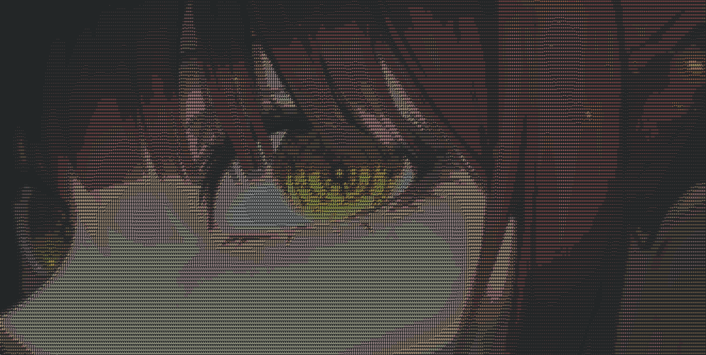
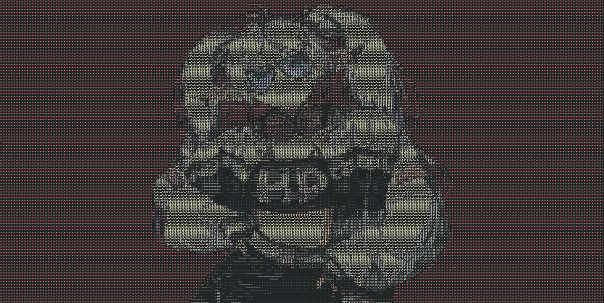

# 🚀 ASCII ART GENERATOR

> A small ascii generator I did to learn a bit of c

---

## 📝 Introduction

This is a small project to get an introduction into the quirks of c. Comming from a Java background it helped me understand basic but challenging topics like pointers and sending parameters as value or as reference.

## ⚙️ How it works

The project itself is nothing crazy, it uses a library to convert common image formats into a bitmap, then it is resized to a smaller size. After that it selects a character to represent each pixel based on the brightness and calculates the ANSII color that best matches the color of each pixel. In the end it prints the result on the console (with color) and saves on a file (colorless) if specified.

This is the repo with the libraries used here and much more:
https://github.com/nothings/stb/tree/master  

---
## 🔧 How to install
1. **Clone the repo**
To clone the repo execute the following command on the container folder
   ```bash
   git clone [https://github.com/ChristianLuci/AsciiArtGenerator](https://github.com/ChristianLuci/AsciiArtGenerator)

Then compile the project using the following command
  ```bash
  gcc src/main.c src/stb_image_impl.c -o "main" -lm

## 🚀 How to execute

Execute the file with the following flags:

- `-help` -> Displays the available parameters.
- `-i` -> Specifies the image to use.
- `-w` [optional] -> Specifies the width of the console output (default is 300 pixels). The height uses the same proportions as the original image.
- `-o` [optional] -> Specifies the output path of the .txt with the ascii characters of the image.


## 📌 Execution examples
Command:    
```bash
main -i "image/example.png" -w 375

Result:
    
